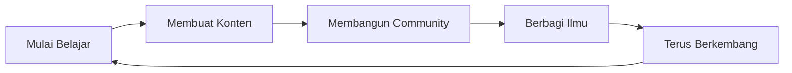

<div align="center">
  
# 👋 Halo, Saya Evandra Yhoga Pratama!


### 🚀 Membuat Konten Tentang Pemrograman & Teknologi

<p align="center">
  
  
  
  
</p>

</div>

---

## 💫 Tentang Saya

```javascript
const evandra = {
    role: "Content Creator & Developer",
    location: "Indonesia 🇮🇩",
    passions: ["Coding", "Teaching", "Creating Content"],
    currentFocus: "Membuat tutorial pemrograman yang mudah dipahami",
    motto: "Code, Create, Share! 💻✨",
    funFact: "Kopi adalah bahan bakar utama saya! ☕"
};
```

- 🎥 Membuat konten edukatif tentang programming di YouTube
- 💡 Berbagi tips & trik coding untuk pemula
- 🌱 Terus belajar dan eksplorasi teknologi baru
- 🤝 Terbuka untuk kolaborasi project menarik
- 📧 Hubungi saya untuk partnership atau pertanyaan

---

## 🛠️ Tech Stack & Tools

<div align="center">

### 💻 Languages & Frameworks


### 🔧 Tools & Platforms


### 🎨 Design & Content Creation


</div>

---

## 📊 GitHub Statistics

<div align="center">
  
  
</div>

<div align="center">
  
</div>

<div align="center">
  
</div>

---

## 🎯 Fokus Saat Ini

```javascript
const currentProjects = {
    learning: ["Advanced JavaScript", "React.js", "Node.js Backend"],
    creating: "Tutorial Series untuk Pemula",
    building: "Open Source Tools untuk Developer Indonesia",
    exploring: "AI & Machine Learning",
    goal2025: "1000+ Developers Terbantu 🎯"
};
```

---

## 🏆 Pencapaian & Highlights

<div align="center">

| 🎥 YouTube | 📱 Instagram | 💬 Discord | 📧 Email |
|:---:|:---:|:---:|:---:|
| **Tutorial Videos** | **Daily Tips** | **Community** | **Business** |
| Coding Tutorials | Programming Memes | Tech Discussion | Collaboration |

</div>

---

## 📺 Konten Terbaru

<!-- YOUTUBE:START -->
- 🎬 Tutorial JavaScript untuk Pemula
- 🚀 Membuat Bot WhatsApp dengan Node.js
- 💻 Tips & Trik VSCode untuk Developer
- 🎨 Design to Code: HTML & CSS
- 🔥 Project Portofolio dengan React
<!-- YOUTUBE:END -->

---

## 💬 Quote Favorit

<div align="center">

> ### *"Code is like humor. When you have to explain it, it's bad."*
> #### – Cory House


</div>

---

## 🤝 Mari Terhubung!

<div align="center">

[](https://www.youtube.com/@tamagoofc)
[](https://instagram.com/vanns01_)
[](https://discord.gg/evandra._)
[](mailto:hirobusines@gmail.com)
[](-)

</div>

---

## 🎯 Kenapa Subscribe & Follow?

<div align="center">

| 📚 Tutorial Berkualitas | 🆓 100% Gratis | 🇮🇩 Bahasa Indonesia | 💡 Tips & Tricks |
|:---:|:---:|:---:|:---:|
| Materi terstruktur | Tanpa biaya | Mudah dipahami | Langsung praktis |

</div>

---

## 💼 Kolaborasi & Partnership

Saya terbuka untuk berbagai bentuk kolaborasi:

- 🎥 **Content Collaboration** - Bikin konten bareng
- 🛠️ **Project Development** - Kerjakan project bersama
- 📝 **Technical Writing** - Artikel & tutorial
- 🎤 **Speaking Engagements** - Workshop & webinar
- 💡 **Consulting** - Konsultasi project & teknologi

📩 **Email saya:** hirobusines@gmail.com

---

## 📈 Journey Timeline



---

## 🎁 Support My Work

Jika konten saya bermanfaat, dukung saya dengan cara:

- ⭐ Star repositories yang bermanfaat
- 🔔 Subscribe channel YouTube
- 👍 Like & Share konten
- 💬 Komen & beri feedback
- 🤝 Rekomendasikan ke teman

---

<div align="center">

### 🌟 "Belajar, Berbagi, Berkembang Bersama!" 🌟


---

⭐️ **From [Evandra Yhoga Pratama](https://github.com/evandraPratama) with ❤️**

*Last Updated: 2025*

</div>
